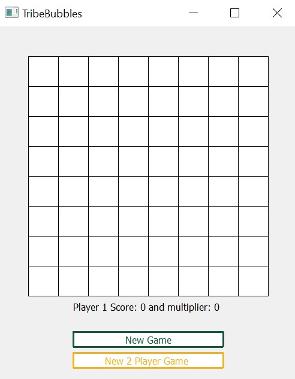
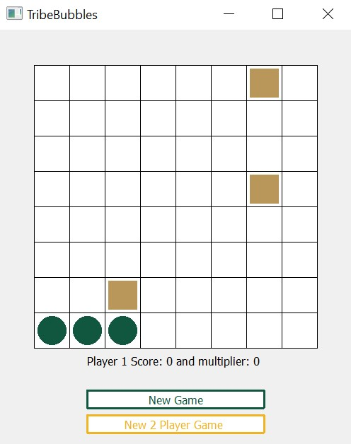
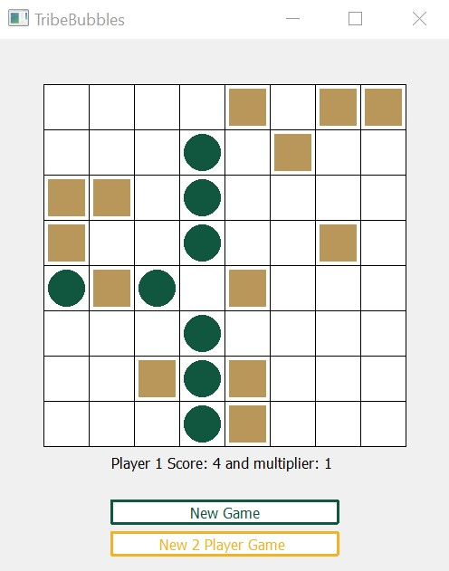
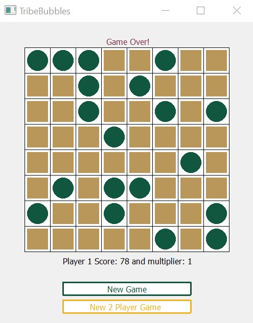
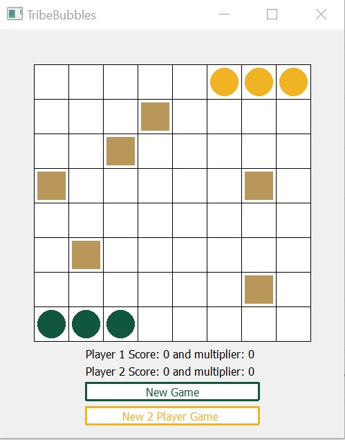
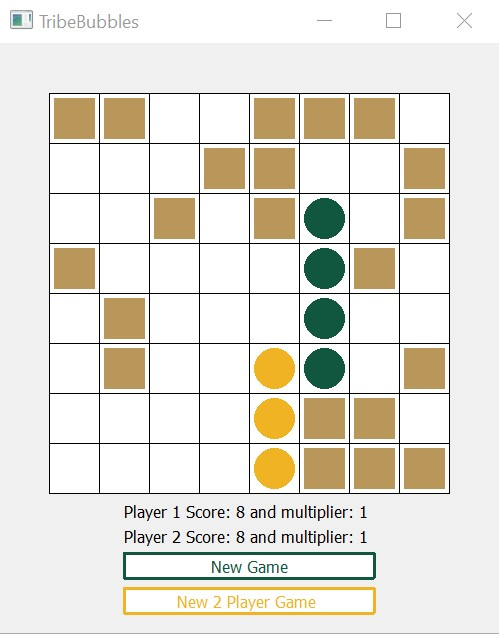
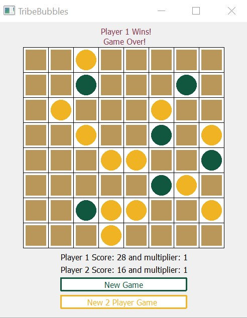

## Coding Projects

### DATA 100: Wicked Problems
This class involved a semester's long introduction to R, which was used to analyze development in a particular country.  
I focused on an analysis of Mongolia, particularly Hovsgol and Darhan-Uul.  
My final project is viewable [on GitHub Pages](https://caroline-mccain.github.io/workshop/). The code and raw files are available [on Github](https://github.com/caroline-mccain/workshop).

### CSCI 141: Computational Problem Sovling
#### Tribe Bubbles
The final project for this class was to create a game called "Tribe Bubbles." In it, the user tries to create lines of four (or multiples of four) to score points. Each click that the player makes prompts a random blocker to be placed. The game keeps track of the player's score, the appropriate multiplier, and the blockers. I also implemented a two player version. In the two palyer version, players can block each other's moves.  
The code for this project cannot be publicly listed due to the honor code. It utilizes PyQt5, primarily QWidget. The code relies on a 2-dimensional array, for statements, and conditionals. Since the code cannot be made public, below are screenshots of the game in action.  
The Initial Gameboard:  
  
One Player Game:  
A player about to score:  
  
A player about to score & increase their multiplier:  
  
Game Over:  
  

Two Player Game:  
Before any player has scored:  
  
Mid game:  
  
End of game, Player 1 Won:  
  

### CSCI 241: Data Structures

### CSCI 301: Software Development

### CSCI 303: Algorithms  

[Home](https://caroline-mccain.github.io/) - [Coding](https://caroline-mccain.github.io/projects) - [Writing](https://caroline-mccain.github.io/writing) - [Bio](https://caroline-mccain.github.io/bio)
